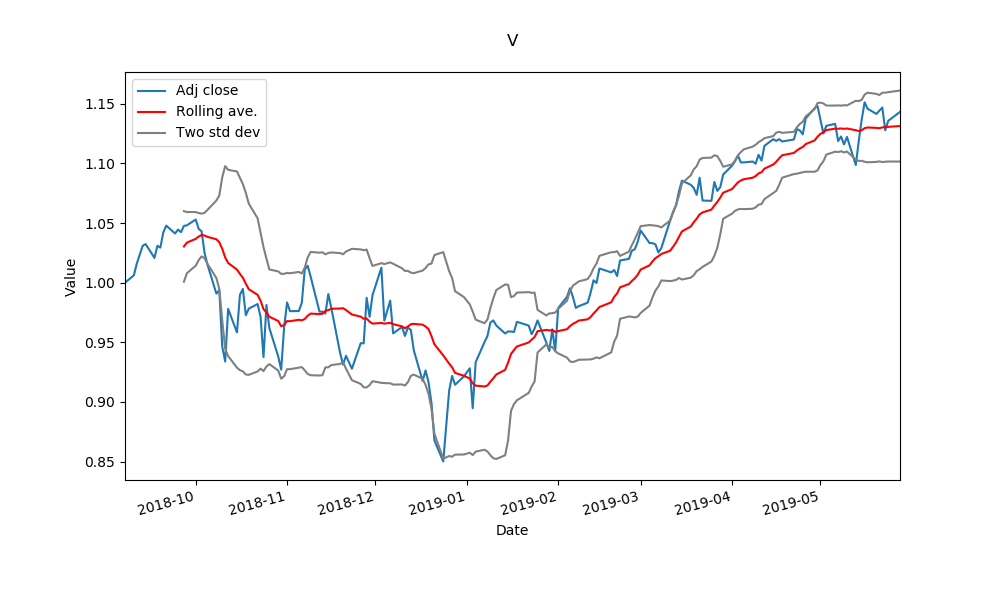
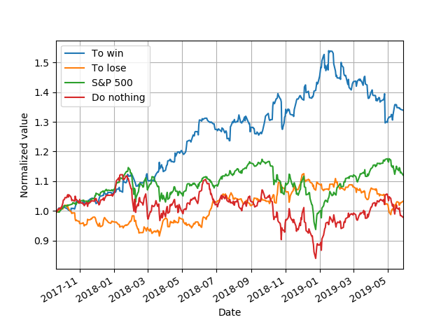

# Q-trading
Q-learn agent for portfolio management

Code reads S&P 100 companies from wikipedia page.
For these companies, closing data is retrieved for given time period.

Clustering is performed to determine which companies to choose to portfolio. Assuming that companies in different clusters give a stronger portfolio.

Q-learning agent is trained to training data and then tested to test data, to WIN and to LOSE.

Results are compared to average S&P 500 stock and to static portfolio.

